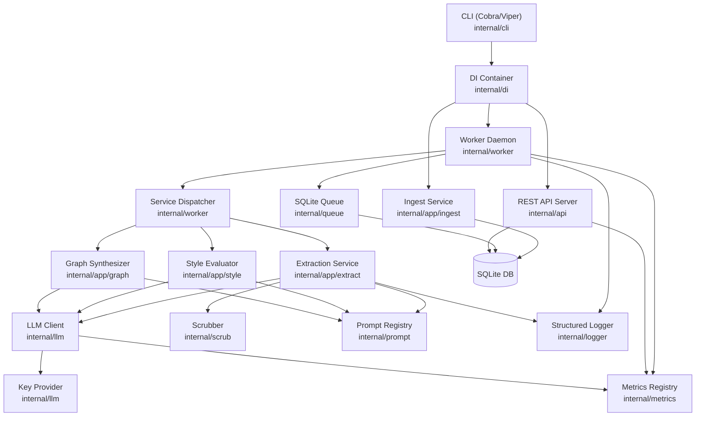
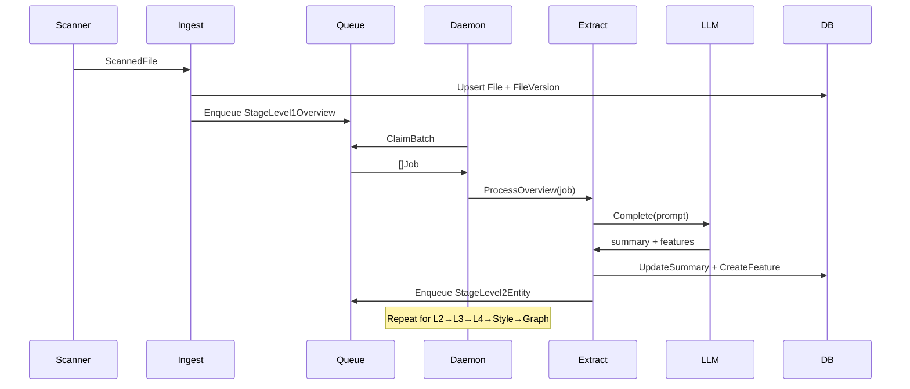

# Design Document: ProWiki Gap Analysis

## Overview

ProWiki is a persistent background daemon that continuously scans, parses, and documents a Go codebase using LLMs. The system uses an embedded SQLite database as its queue and knowledge store, a Cobra/Viper CLI, and a go-litellm client for LLM connectivity.

This document describes the technical design for resolving 17 identified gaps between the current implementation and the target architecture. The gaps span ingestion unification, LLM extraction pipeline completion, code-style baseline, graph synthesis, token routing, prompt registry, PII scrubbing, CLI/API surface, observability, web UI, schema indexes, key rotation, AST parsing, tokenizer accuracy, and entry-point consolidation.

### Design Philosophy

- **Single Canonical Path**: Every subsystem has one implementation wired through the DI container; no duplicate implementations co-exist.
- **Interface-Driven Design**: All cross-package dependencies flow through interfaces defined in `internal/domain`, enabling independent testing and substitution.
- **Fail-Safe Defaults**: Every LLM-touching component has conservative fallbacks (4096 token limit, `HeuristicCounter`) so the daemon can always start.
- **Structured Observability**: All log output is JSON; all metrics are Prometheus; the same registry instance is shared across the process.

---

## Architecture

### High-Level Component Map



### Data Flow: File → Knowledge



---

## Components and Interfaces

### 1. Ingest Service (`internal/app/ingest`)

The canonical ingestion path. Replaces `internal/versioning`.


**New interface additions to `ingest.Service`:**

```go
// internal/app/ingest/service.go
type FileStore interface {
    GetOrCreate(ctx context.Context, projectID int64, relPath string) (*domain.File, error)
}

type FileVersionStore interface {
    LatestByFileID(ctx context.Context, fileID int64) (*domain.FileVersion, error)
    InsertVersion(ctx context.Context, tx *sql.Tx, v *domain.FileVersion) error
    SetLatest(ctx context.Context, tx *sql.Tx, newID, oldID int64) error
    CloneJunctions(ctx context.Context, tx *sql.Tx, oldVersionID, newVersionID int64) error
}

type JobStore interface {
    EnqueueMany(ctx context.Context, tx *sql.Tx, jobs []domain.Job) error
    ResetCompletedForTarget(ctx context.Context, tx *sql.Tx, oldVersionID int64) error
}
```

**Language detection** is a pure function used by both the ingest service and the extraction service:

```go
// internal/domain/language.go
func LanguageFromPath(path string) Language {
    switch strings.ToLower(filepath.Ext(path)) {
    case ".go":   return Language("go")
    case ".py":   return Language("python")
    case ".js":   return Language("javascript")
    case ".ts":   return Language("typescript")
    default:      return Language("")
    }
}
```

The `internal/versioning` package is deleted. The DI container wires `ingest.Service` directly.

### 2. Extraction Service (`internal/app/extract`)

Implements all four LLM extraction stages. Current state: only `ProcessOverview` is implemented; `ProcessEntity`, `ProcessFeature`, `ProcessEdgeCase` are stubs.

**New methods added to `extract.Service`:**

```go
func (s *Service) ProcessEntity(ctx context.Context, job *domain.Job) error
func (s *Service) ProcessFeature(ctx context.Context, job *domain.Job) error
func (s *Service) ProcessEdgeCase(ctx context.Context, job *domain.Job) error
```

Each method follows the same pattern as `ProcessOverview`: fetch FileVersion, scrub, render prompt, call LLM, parse structured response, persist, enqueue next stage.

`ProcessFeature` queries features linked to the file version via `file_features`. If fewer than 2 features are found, it skips the LLM call and completes the job.

`ProcessEdgeCase` persists annotations as `StyleAnomaly` with `code_style_id = 0`.

The scrubber language is derived from `domain.LanguageFromPath(file.Path)` rather than the hardcoded `"go"` string currently in `ProcessOverview`.

### 3. Service Dispatcher (`internal/worker/dispatcher.go`)

All six stage cases (plus `StageMacroSynthesis`) are wired to real handlers. No case returns "not yet fully implemented".

```go
func (d *ServiceDispatcher) Dispatch(ctx context.Context, job domain.Job) (domain.TxFunc, error) {
    switch job.Stage {
    case domain.StageLevel1Overview:       return d.extractor.ProcessOverview(ctx, &job)
    case domain.StageLevel2Entity:         return d.extractor.ProcessEntity(ctx, &job)
    case domain.StageLevel3Feature:        return d.extractor.ProcessFeature(ctx, &job)
    case domain.StageLevel4EdgeCase:       return d.extractor.ProcessEdgeCase(ctx, &job)
    case domain.StageStyleEvaluation:      return d.style.Evaluate(ctx, &job)
    case domain.StageIntersectionSynthesis: return d.graph.Synthesize(ctx, &job)
    case domain.StageMacroSynthesis:       return d.macro.Synthesize(ctx, &job)
    default:                               return nil, fmt.Errorf("unknown stage: %s", job.Stage)
    }
}
```

### 4. Style Evaluator (`internal/app/style`)

**Baseline discovery** is added to the `Evaluate` method. On entry, if `StyleStore.CountByProject(ctx, projectID) < MIN_STYLE_SAMPLES` (default 3), the evaluator runs baseline discovery first using the Tier 2 model.

Model selection uses `LLMConfigStore.GetByTier` — no hardcoded model strings.

### 5. Graph Synthesizer (`internal/app/graph`)

**New methods:**

```go
func (s *Synthesizer) EnqueuePendingIntersections(ctx context.Context, projectID int64) error
func (s *Synthesizer) SynthesizeJob(ctx context.Context, job *domain.Job) error
```

`EnqueuePendingIntersections` calls `GraphStore.GetUnprocessedFeaturePairs` and inserts `StageIntersectionSynthesis` jobs. When zero pairs remain, it calls `GraphStore.DiscoverMacroPipelines` and inserts `MacroPipeline` records with `StageMacroSynthesis` jobs.

The second feature ID is encoded as a JSON payload field in the `Job` struct (requires adding a `Payload string` column to `job_queue`).

**New `GraphStore` methods:**

```go
func (s *GraphStore) GetUnprocessedFeaturePairs(ctx context.Context, projectID int64) ([]domain.FeaturePair, error)
func (s *GraphStore) CreateMacroPipeline(ctx context.Context, mp *domain.MacroPipeline) error
```

### 6. Prompt Registry (`internal/prompt`)

`DBRegistry` replaces `HardcodedRegistry` in the DI container. The `Render` method is updated to include the stage name in template execution errors:

```go
if err := t.Execute(&buf, vars); err != nil {
    return "", fmt.Errorf("template render failed for stage %s: %w", tmpl.Stage, err)
}
```

### 7. Scrubber (`internal/scrub`)

Four new regex rules added to `RegexScrubber`:

- JWT: `eyJ[A-Za-z0-9\-_]+\.[A-Za-z0-9\-_]+\.[A-Za-z0-9\-_]*`
- PEM block: `-----BEGIN (RSA |EC |OPENSSH )?PRIVATE KEY-----[\s\S]*?-----END[^\n]*PRIVATE KEY-----`
- GitHub PAT: `gh[pousr]_[A-Za-z0-9]{36}`
- Hex in KV: `(?i)(?:password|secret|key|token|api_key)["\s:=]+["']?([0-9a-fA-F]{32,})["']?`

The `Scrub` method already returns `(redacted string, hits int)` — no signature change needed.


### 8. Cobra CLI (`internal/cli`)

The existing flag-based `cli.App` is removed. All commands are registered as Cobra subcommands on `rootCmd`. New subcommands:

| Command | File |
|---------|------|
| `prowiki get <resource>` | `internal/cli/get.go` |
| `prowiki describe <resource> <id>` | `internal/cli/describe.go` |
| `prowiki retry <job-id>` | `internal/cli/retry.go` |
| `prowiki run` | `internal/cli/run.go` |

Global flags registered with Viper (prefix `PROWIKI_`): `-o/--output`, `-l/--limit`, `-w/--watch`, `--dir`, `--workers`, `--progress`.

The `prowiki serve` command starts both the API server and the Daemon in separate goroutines, blocking until SIGINT/SIGTERM.

### 9. REST API (`internal/api`)

New routes added to `Server.Start`:

```
GET  /api/entities
GET  /api/entities/:id
GET  /api/graph
GET  /api/macros
GET  /api/dlq
POST /api/dlq/:id/retry
GET  /api/prompts
PUT  /api/prompts/:id
GET  /api/styles
GET  /api/styles/:id/anomalies
GET  /metrics
```

Error handling middleware wraps `domain.ErrNotFound` → HTTP 404 and all other errors → HTTP 500.

The `/metrics` endpoint delegates to `promhttp.HandlerFor(metricsRegistry, promhttp.HandlerOpts{})`.

### 10. Metrics (`internal/metrics`)

New package:

```go
type Registry struct {
    JobsTotal    *prometheus.CounterVec  // labels: stage, status
    LLMRequests  *prometheus.CounterVec  // labels: model, status
    QueueDepth   *prometheus.GaugeVec    // label: status
    promReg      *prometheus.Registry
}

func NewRegistry() *Registry
func (r *Registry) IncJobsTotal(stage, status string)
func (r *Registry) IncLLMRequests(model, status string)
func (r *Registry) SetQueueDepth(ctx context.Context, db *sql.DB)
func (r *Registry) Handler() http.Handler
```

### 11. Structured Logger (`internal/logger`)

New package wrapping `log/slog` (Go 1.21+):

```go
type Logger struct{ slog *slog.Logger }

func New(level slog.Level, w io.Writer) *Logger
func (l *Logger) Info(msg string, fields ...any)
func (l *Logger) Warn(msg string, fields ...any)
func (l *Logger) Error(msg string, fields ...any)
func (l *Logger) Debug(msg string, fields ...any)
```

JSON handler with RFC3339Milli time format. Log level is controlled by `PROWIKI_LOG_LEVEL`. Created in `di.NewContainer` and injected into all components.

### 12. AST Parser (`internal/ast`)

Language-specific stripping rules:

| Language | Strip |
|----------|-------|
| `go` | `//` line comments, `/* */` block comments (multi-line) |
| `python` | `#` line comments, `"""..."""` and `'''...'''` docstrings |
| `javascript`, `typescript` | Same as `go` |
| `""` / unknown | Blank lines only |

Blank lines are always stripped in the final normalization pass regardless of language.

### 13. Tokenizer (`internal/tokenizer`)

New `TikTokenCounter` using the `github.com/pkoukk/tiktoken-go` library with `cl100k_base` encoding. Constructor returns an error if the encoding cannot be loaded; `di.NewContainer` falls back to `HeuristicCounter` with a `warn` log.

The `domain.Counter` interface signature is updated:

```go
type Counter interface {
    Count(text string) (int, error)
    CountMessages(msgs []domain.Message) (int, error)
}
```

### 14. Key Provider (`internal/llm`)

New interface in `domain`:

```go
type KeyProvider interface {
    APIKey(ctx context.Context) (string, error)
    Refresh(ctx context.Context) (string, error)
    Rotate(ctx context.Context, newKey string) error
}
```

`EnvKeyProvider` implementation reads the environment variable at call time (not cached). `LitellmClient` accepts a `KeyProvider`. The Daemon's rotation flow uses an atomic `rotationInProgress` flag (`sync/atomic`) to pause job claiming during key rotation.

### 15. Entry Point (`cmd/prowiki/main.go`)

```go
package main

import "github.com/andrejsstepanovs/prowiki/internal/cli"

func main() { cli.Execute() }
```

The root `main.go` is deleted (or converted to a `//go:build ignore` example file). The Makefile `build` target already references `./cmd/prowiki`.

---

## Data Models

### New Columns / Tables

**`job_queue` — add `payload` column** (stores secondary context for jobs like the second feature ID in intersection synthesis):

```sql
ALTER TABLE job_queue ADD COLUMN payload TEXT NOT NULL DEFAULT '';
```

**`projects` — add `fs_location` column** (for `prowiki init`):

```sql
ALTER TABLE projects ADD COLUMN fs_location TEXT NOT NULL DEFAULT '';
```

**Migration 000003 — indexes and constraints:**

```sql
-- feature_interactions
CREATE INDEX IF NOT EXISTS idx_fi_from_to
    ON feature_interactions(from_feature_id ASC, to_feature_id ASC);

-- style_anomalies
CREATE INDEX IF NOT EXISTS idx_sa_file_version
    ON style_anomalies(file_version_id ASC);
CREATE INDEX IF NOT EXISTS idx_sa_code_style
    ON style_anomalies(code_style_id ASC);

-- entities
CREATE INDEX IF NOT EXISTS idx_entities_project
    ON entities(project_id ASC);
CREATE UNIQUE INDEX IF NOT EXISTS uq_entities_project_name_type
    ON entities(project_id, name, type);

-- features
CREATE UNIQUE INDEX IF NOT EXISTS uq_features_project_name
    ON features(project_id, name);
```

**Migration 000002 update** — add the missing `level_4_edge_case` and `intersection_synthesis` seed rows using `INSERT OR IGNORE`.

### Domain Model Extensions

```go
// domain/entities.go additions
type FeaturePair struct {
    FeatureA domain.Feature
    FeatureB domain.Feature
}

// Job gains Payload field
type Job struct {
    // ... existing fields ...
    Payload string `json:"payload"`
}
```

---

## Correctness Properties

*A property is a characteristic or behavior that should hold true across all valid executions of a system — essentially, a formal statement about what the system should do. Properties serve as the bridge between human-readable specifications and machine-verifiable correctness guarantees.*

### Property 1: Ingest clone-on-unchanged-hash

*For any* file with existing features and an unchanged AST hash, re-ingesting that file SHALL result in a new `FileVersion` record whose `file_features` junction rows are identical to the previous version's, no new `StageLevel1Overview` job enqueued, and the new version marked as latest.

**Validates: Requirements 1.2**

### Property 2: Ingest cascade invalidation on changed hash

*For any* file version with one or more `completed` jobs and a changed AST hash, re-ingesting SHALL reset those completed jobs to `pending` with priority incremented by 10, and enqueue exactly one new `StageLevel1Overview` job targeting the new version.

**Validates: Requirements 1.3**

### Property 3: Language detection from file path

*For any* file path whose lowercased extension is one of `.go`, `.py`, `.js`, `.ts`, or any other value, `LanguageFromPath` SHALL return the corresponding `domain.Language` value (`"go"`, `"python"`, `"javascript"`, `"typescript"`, or `""`), never panicking.

**Validates: Requirements 1.5, 7.6**

### Property 4: Extraction pipeline fan-out (Level 1)

*For any* `FileVersion` content and LLM response with N features, running `ProcessOverview` SHALL persist exactly N `Feature` records, N `file_features` junction rows, one updated summary on the `FileVersion`, and exactly one `StageLevel2Entity` job.

**Validates: Requirements 2.1**

### Property 5: Extraction pipeline fan-out (Level 2)

*For any* `FileVersion` and LLM response with N entities (including N=0), running `ProcessEntity` SHALL persist exactly N `Entity` records and enqueue exactly one `StageLevel3Feature` job.

**Validates: Requirements 2.2**

### Property 6: Feature pair threshold for Level 3

*For any* `FileVersion` with F features linked via `file_features`: if F < 2, running `ProcessFeature` SHALL complete the job without calling the LLM; if F ≥ 2, it SHALL call the LLM for each ordered pair and persist the resulting `FeatureInteraction` records.

**Validates: Requirements 2.3**

### Property 7: Style baseline threshold

*For any* project with C existing `CodeStyle` records: if C < MIN_STYLE_SAMPLES, running style evaluation SHALL first execute baseline discovery and persist new rules before evaluating; if C ≥ MIN_STYLE_SAMPLES, it SHALL evaluate directly against existing rules without calling the baseline LLM.

**Validates: Requirements 3.1, 3.3**

### Property 8: Unprocessed feature pairs query

*For any* set of features and existing `feature_interactions` rows, `GraphStore.GetUnprocessedFeaturePairs` SHALL return exactly those `(A, B)` pairs where `A.id < B.id`, both share the same `project_id`, and no interaction row exists for either direction of the pair.

**Validates: Requirements 4.4**

### Property 9: Idle daemon enqueues intersection jobs

*For any* project with N features and M existing interactions, a call to `EnqueuePendingIntersections` SHALL enqueue exactly `(N*(N-1)/2 - M)` new `StageIntersectionSynthesis` jobs (assuming no duplicate interactions exist).

**Validates: Requirements 4.1**

### Property 10: Token budget respected before LLM call

*For any* message history and a token budget B, calling `TrimToBudget(B)` before dispatching to the LLM SHALL produce a message list whose token count is ≤ B, while preserving the system message and the most recent messages when trimming is required.

**Validates: Requirements 5.3**

### Property 11: Context overflow retry halves budget

*For any* completion request that triggers `ErrContextOverflow`, the caller SHALL retry exactly once with `TrimToBudget(limit / 2)` applied, and if that retry also returns `ErrContextOverflow`, SHALL return the error without a third attempt.

**Validates: Requirements 5.5**

### Property 12: Prompt render error includes stage name

*For any* `PromptTemplate` and a `vars` map missing a referenced variable, `Render` SHALL return an error whose string includes the template's stage name and the underlying template error text.

**Validates: Requirements 6.5**

### Property 13: JWT token redaction

*For any* string containing one or more substrings matching the JWT pattern `eyJ[A-Za-z0-9\-_]+\.[A-Za-z0-9\-_]+\.[A-Za-z0-9\-_]*`, `Scrub` SHALL replace each match with `[REDACTED_SECRET]` and the returned count SHALL equal the number of replaced sites.

**Validates: Requirements 7.1, 7.5**

### Property 14: PEM private key block redaction

*For any* string containing one or more PEM private key blocks (matching `-----BEGIN ... PRIVATE KEY-----` through `-----END ... PRIVATE KEY-----` including multi-line), `Scrub` SHALL replace the entire block with `[REDACTED_SECRET]`.

**Validates: Requirements 7.2**

### Property 15: GitHub PAT and hex-in-KV redaction

*For any* string containing one or more GitHub PAT patterns (`gh[pousr]_[A-Za-z0-9]{36}`) or hex-value-in-KV-assignment patterns, `Scrub` SHALL replace each match with `[REDACTED_SECRET]` and the returned count SHALL reflect all replacement sites.

**Validates: Requirements 7.3, 7.4, 7.5**

### Property 16: AST hash ignores comments (Go/JS/TS)

*For any* Go, JavaScript, or TypeScript source file content, adding, removing, or changing only `//` line comments or `/* */` block comments SHALL produce an identical structural hash.

**Validates: Requirements 15.1, 15.3**

### Property 17: AST hash ignores Python docstrings and comments

*For any* Python source file content, adding, removing, or changing only `#` comment lines or `"""..."""` / `'''...'''` docstring blocks SHALL produce an identical structural hash.

**Validates: Requirements 15.2**

### Property 18: AST hash blank-line invariant

*For any* source file content and any language (including unknown), inserting or removing blank lines between non-blank structural lines SHALL produce an identical structural hash.

**Validates: Requirements 15.4, 15.6**

### Property 19: Heuristic counter within factor of 2 of BPE

*For any* non-empty string of length between 10 and 10,000 characters, the ratio `HeuristicCounter.Count(s) / TikTokenCounter.Count(s)` SHALL be between 0.5 and 2.0.

**Validates: Requirements 16.5**

### Property 20: CountMessages sum invariant

*For any* list of messages, `CountMessages(msgs)` SHALL equal the sum of `Count(msg.Content)` for each message plus 4 tokens per message for role and formatting overhead.

**Validates: Requirements 16.6**

### Property 21: API ErrNotFound consistently maps to HTTP 404

*For any* API handler that calls a store method returning `domain.ErrNotFound`, the HTTP response SHALL have status 404 and a JSON body `{"error": "not found"}`.

**Validates: Requirements 9.12**

### Property 22: Structured log lines are valid JSON with required fields

*For any* log event emitted at any level, the output line SHALL be parseable as a JSON object containing at minimum the fields `level` (string), `ts` (RFC3339 with millisecond precision), and `msg` (string).

**Validates: Requirements 10.1**

---

## Error Handling

### LLM Errors

| Error | Behaviour |
|-------|-----------|
| `domain.ErrContextOverflow` | Trim to half budget, retry once. If overflow again, return error to dispatcher → job fails. |
| `domain.ErrAuthRotation` | Daemon sets `rotationInProgress` flag, drains in-flight jobs, rotates key via `KeyProvider.Rotate`, re-queues the triggering job. After 3 consecutive rotation failures, daemon halts and logs `error`. |
| Network / 5xx | Exponential backoff (1s, 2s, 4s) in `LitellmClient.Complete`, max 3 retries, then return error. |
| `domain.ErrNotFound` (missing prompt) | Job fails, enqueued back to queue with retry counter incremented by 1. |

### Queue / Job Errors

- `ClaimBatch` error: log at `error` level, sleep poll delay, retry next cycle.
- `queue.Fail` failure: log at `error` level — the job remains `processing` and will be timed out by a future cleanup pass (future work: add a `stuck_processing` reaper).
- Panic in `processJobSafe`: recovered, job marked `failed`, logged at `error` with stack trace.
- DLQ threshold: after `MAX_RETRIES` (default 5) failures, `queue.Fail` moves the job to `dead_letter_queue`.

### Ingestion Errors

- Unreadable file: logged at `warn`, skipped — does not abort the walker.
- AST parse error: logged at `warn` with the file path, skipped.
- Database transaction error: returned to the caller (CLI or daemon), logged at `error`.

### API Errors

All handlers use a centralized `errorResponse` helper:

```go
func (s *Server) errorResponse(w http.ResponseWriter, err error) {
    if errors.Is(err, domain.ErrNotFound) {
        s.jsonResponse(w, http.StatusNotFound, map[string]string{"error": "not found"})
        return
    }
    s.jsonResponse(w, http.StatusInternalServerError, map[string]string{"error": err.Error()})
}
```

### Startup Errors

- `DiscoverBoundary` failure on startup: log `warn`, persist `safe_token_limit = 4096`, continue.
- `TikTokenCounter` constructor failure: log `warn`, use `HeuristicCounter`, continue.
- `di.NewContainer` failure: propagates to CLI, printed to stderr, process exits with code 1.

---

## Testing Strategy

### Dual Testing Approach

Unit tests cover specific examples and edge cases. Property-based tests cover universal invariants across randomized inputs. Both are required for comprehensive coverage.

### Property-Based Testing Library

**Library**: `github.com/flyingmutant/rapid` — the idiomatic Go PBT library with built-in generators for strings, integers, slices, and custom types.

Each property test runs a minimum of **100 iterations** via `rapid.Check`. Each test is tagged with a comment referencing the design property:

```go
// Feature: prowiki-gap-analysis, Property 1: Ingest clone-on-unchanged-hash
func TestIngestCloneOnUnchangedHash(t *testing.T) {
    rapid.Check(t, func(rt *rapid.T) { ... })
}
```

### Test Coverage by Subsystem

**`internal/app/ingest`** (Properties 1, 2, 3)
- Property tests: unchanged-hash clone, changed-hash cascade, language detection mapping
- Unit tests: first ingest of a new file, transaction rollback on store error

**`internal/app/extract`** (Properties 4, 5, 6)
- Property tests: ProcessOverview fan-out count, ProcessEntity fan-out count, ProcessFeature pair threshold
- Unit tests: empty feature list handling, LLM error propagation

**`internal/app/style`** (Property 7)
- Property tests: baseline threshold branching
- Unit tests: baseline persisted in same transaction, model tier lookup failure

**`internal/app/graph`** (Properties 8, 9)
- Property tests: unprocessed pairs query correctness, intersection job count
- Unit tests: macro pipeline creation when all pairs processed

**`internal/llm`** (Properties 10, 11)
- Property tests: TrimToBudget respects budget, overflow retry halves budget
- Unit tests: token boundary discovery fallback, key rotation flow

**`internal/prompt`** (Property 12)
- Property tests: render error includes stage name
- Unit tests: ErrNotFound on missing active row, DBRegistry vs HardcodedRegistry parity

**`internal/scrub`** (Properties 13, 14, 15)
- Property tests: JWT redaction, PEM block redaction, GitHub PAT and hex-KV redaction
- Unit tests: existing AWS key and Bearer patterns unchanged, hit count accuracy

**`internal/ast`** (Properties 16, 17, 18)
- Property tests: comment invariance (Go/JS/TS), Python docstring invariance, blank-line invariance
- Unit tests: known Go file before/after comment removal, unknown language fallback

**`internal/tokenizer`** (Properties 19, 20)
- Property tests: heuristic within factor of 2 of BPE, CountMessages sum invariant
- Unit tests: empty string returns 0, TikTokenCounter fallback on load failure

**`internal/api`** (Property 21)
- Property tests: ErrNotFound → HTTP 404 for all handlers
- Unit tests: each new endpoint with valid data, PUT prompt validation

**`internal/logger`** (Property 22)
- Property tests: all log calls produce valid JSON with required fields
- Unit tests: log level filtering (debug suppressed at info level), PROWIKI_LOG_LEVEL env var

**`internal/worker`** (integration)
- Integration tests: full daemon cycle with in-memory SQLite, all 7 stage dispatches succeed
- Unit tests: idle polling triggers `EnqueuePendingIntersections`

**`internal/cli`** (example/smoke)
- Example tests: each verb produces expected output format, `retry` atomicity, `--output` flag validation
- Integration tests: `prowiki init` creates DB and project row, `prowiki run` starts daemon

**`migrations/`** (smoke)
- Smoke tests: migration runner applies all migrations without error, down migrations clean up

### Test Configuration

```go
// rapid default: 100 iterations; increase for critical properties
rapid.Check(t, func(rt *rapid.T) { ... })
// For scrubber properties involving regex correctness, use 500 iterations:
rapid.Check(t, rapid.Settings{Checks: 500}, func(rt *rapid.T) { ... })
```

All property tests use mocked LLM clients and in-memory SQLite (`:memory:`) so they run entirely in-process with no network calls.

